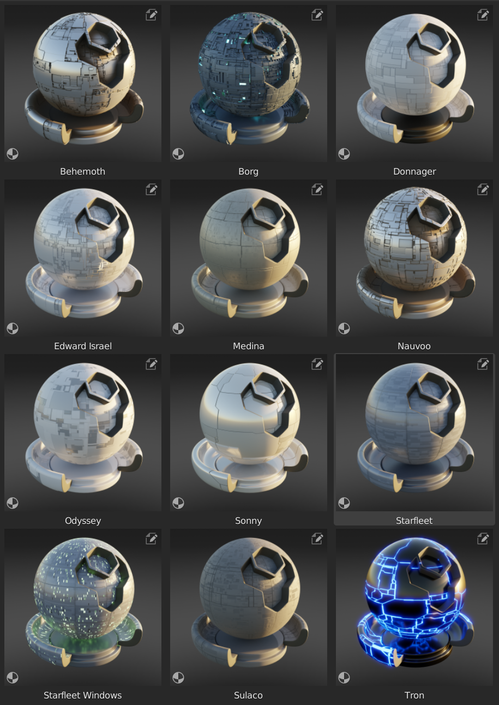

.. Hull Materials Documentaion documentation master file, created by
   sphinx-quickstart on Tue Oct 18 13:59:34 2022.
   You can adapt this file completely to your liking, but it should at least
   contain the root `toctree` directive.

Sci-Fi Hull Materials
######################

Get these |Blender| Sci-Fi hull materials |here|.

.. |Blender| raw:: html

   <a href="https://www.blender.org/" target="_blank">Blender</a>

.. |here| raw:: html

   <a href="https://store.configurate.net/l/hull-texture" target="_blank">here</a>

.. note::
    Mainly compatable with Cycles.  See each material section.

.. toctree::
   :maxdepth: 2
   :caption: Contents:

   installation

.. toctree::
   :maxdepth: 2
   :caption: Materials:

   mat_behemoth
   mat_borg
   mat_donnager
   mat_edward_israel
   mat_medina
   mat_nauvoo
   mat_odyssey
   mat_sonny
   mat_starfleet_windows
   mat_starfleet
   mat_sulaco
   mat_tron
   
   
   
   
