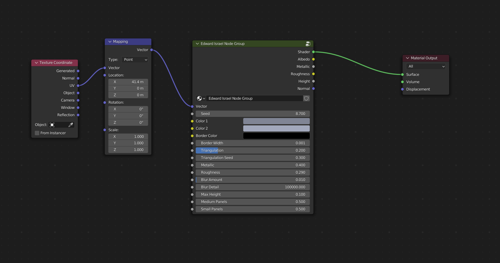

.. Hull Materials Documentaion documentation master file, created by
   sphinx-quickstart on Tue Oct 18 13:59:34 2022.
   You can adapt this file completely to your liking, but it should at least
   contain the root `toctree` directive.

Sci-Fi Hull Materials
######################

Get these |Blender| Sci-Fi hull materials |here|.

.. |Blender| raw:: html

   <a href="https://www.blender.org/" target="_blank">Blender</a>

.. |here| raw:: html

   <a href="https://store.configurate.net/l/hull-texture" target="_blank">here</a>

   

Odyssey
######################

A straightforward variation of different sized panels.

.. image:: ./_static/images/thumb_odyssey.png
  :alt: Odyssey Material
  :width: 100%

.. image:: ./_static/images/nodes_odyssey.png
  :alt: Odyssey Material
  :width: 100%

* **Cycles:** Recommended
* **EEVEE:** Set blur size to zero

Odyssey Inputs
**********************************

* **Vector**: The UV Mapping Vector Input. A UV Map is recommended.
* **Color1**: First color variation for panels.
* **Color2**: Second color variation for panels.
* **Metallic**: Amount of metalness for the material shader.
* **Specular**: Specular Level for the material shader.
* **Blur Amount**: Amount of noise introduced to blue the texture.  Best for Cycles. Set to zero for EEVEE.
* **Blur Detail**: The size of the noise used for the blur effect.
* **Bump Height**: The maximum height for the bump map effect.

Odyssey Outputs
**********************************

* **Shader**: The overall material shader output.
* **Albedo**: The diffuse color channel.
* **Metallic**: The metallic map.
* **Roughness**: The roughness map.
* **Height**: The height map, useful for displacement.
* **Normal**: The normal map used for the bump map.

Nauvoo
######################

A variation of big, medium and small sized panels with displacement and wear.

.. image:: ./_static/images/thumb_nauvoo.png
  :alt: Nauvoo Material
  :width: 100%

.. image:: ./_static/images/nodes_nauvoo.png
  :alt: Nauvoo Material
  :width: 100%

* **Cycles:** Recommended with Displacement

Nauvoo Inputs
**************************************

* **Vector**: The UV Mapping Vector Input. A UV Map is recommended.
* **Seed**: Seed to set the random pattern.
* **Triangulation**: The amount of triangulation in the pattern.
* **Color1**: First color variation for panels.
* **Color2**: Second color variation for panels.
* **Rust Color**: The color of the rust around the edges.
* **Rust Amount**: The amount of wear for rust introduced into the pattern.
* **Max Height**: The Maximum height of the panels.
* **Roughness**: The amount of roughness in the texture.
* **Medium Panels**: The amount of medium sized panels.
* **Small Panels**: The amount of small sized panels.

Nauvoo Outputs
**************************************

* **Shader**: The overall material shader output.
* **Displacement**: The displacement normal map.
* **Albedo**: The diffuse color channel.
* **Metallic**: The metallic map.
* **Roughness**: The roughness map.
* **Height**: The height map, useful for displacement.
* **Normal**: The normal map used for the bump map.

Behemoth
######################

Random panels with displacement and wear.

* **Cycles:** Recommended with Displacement

Behemoth Inputs
**************************************

* **Vector**: The UV Mapping Vector Input. A UV Map is recommended.
* **Seed**: Seed to set the random pattern.
* **Color1**: First color variation for panels.
* **Color2**: Second color variation for panels.
* **Rust Color**: The color of the rust around the edges.
* **Rust Amount**: The amount of wear for rust introduced into the pattern.
* **Max Height**: The Maximum height of the panels.
* **Metallic**: The amount of roughness in the texture.
* **Roughness**: The amount of roughness in the texture.

Behemoth Outputs
**************************************

* **Shader**: The overall material shader output.
* **Displacement**: The displacement normal map.
* **Albedo**: The diffuse color channel.
* **Metallic**: The metallic map.
* **Roughness**: The roughness map.
* **Height**: The height map, useful for displacement.
* **Normal**: The normal map used for the bump map.

Sonny
######################

Panels with optional seam borders and triangulation.

.. image:: ./_static/images/nodes_sonny.png
  :alt: Sonny Material
  :width: 100%

* **Cycles:** Recommended
* **EEVEE:** Compatible

Sonny Inputs
**************************************

* **Vector**: The UV Mapping Vector Input. A UV Map is recommended.
* **Seed**: Seed to set the random pattern.
* **Triangulation**: The amount of triangulation in the pattern.
* **Metallic**: The amount of roughness in the texture.
* **Roughness**: The amount of roughness in the texture.
* **Panel Color**: Main color for panels.
* **Seam Color**: Color of the seams between the panels.
* **Color Variation**: The amount of variation in the main color.
* **Medium Panels**: The amount of medium sized panels.
* **Small Panels**: The amount of small sized panels.
* **Max Height**: The Maximum height of the panels.
* **Seam Thickness**: The thickness of the seams between the panels.

Sonny Outputs
**************************************

* **Shader**: The overall material shader output.
* **Displacement**: The displacement normal map.
* **Albedo**: The diffuse color channel.
* **Metallic**: The metallic map.
* **Roughness**: The roughness map.
* **Height**: The height map, useful for displacement.
* **Normal**: The normal map used for the bump map.

Sulaco
######################

Uniform Panels with seams and optional small panel details.

.. image:: ./_static/images/thumb_sulaco.png
  :alt: Sulaco Material
  :width: 100%

.. image:: ./_static/images/nodes_sulaco.png
  :alt: Sulaco Material
  :width: 100%

* **Cycles:** Recommended
* **EEVEE:** Compatible

Sulaco Inputs
**************************************

* **Vector**: The UV Mapping Vector Input. A UV Map is recommended.
* **Seed**: Seed to set the random pattern.
* **Triangulation**: The amount of triangulation in the pattern.
* **Metallic**: The amount of roughness in the texture.
* **Roughness**: The amount of roughness in the texture.
* **Panel Color**: Main color for panels.
* **Seam Color**: Color of the seams between the panels.
* **Color Variation**: The amount of variation in the main color.
* **Medium Panels**: The amount of medium sized panels.
* **Small Panels**: The amount of small sized panels.
* **Max Height**: The Maximum height of the panels.
* **Seam Thickness**: The thickness of the seams between the panels.
* **Mix Small Panels**: Amount of smaller panel detailing to mix into the main panels.
* **Small Panels size**: Size of small panels detailing.
* **Small Panels Blur Amount**: Amount of noise blur on small panel detailing.
* **Small Panel Blur Accuracy**: Level of noise bluring to apply.

Sulaco Outputs
**************************************

* **Shader**: The overall material shader output.
* **Displacement**: The displacement normal map.
* **Albedo**: The diffuse color channel.
* **Metallic**: The metallic map.
* **Roughness**: The roughness map.
* **Height**: The height map, useful for displacement.
* **Normal**: The normal map used for the bump map.

Edward Israel
######################

Overlapping Panels with optional seams and triangulation.

.. image:: ./_static/images/thumb_edward_israel.png
  :alt: Edward Israel Material
  :width: 100%

* **Cycles:** Recommended
* **EEVEE:** Compatible

Edward Israel Inputs
**************************************

* **Vector**: The UV Mapping Vector Input. A UV Map is recommended.
* **Seed**: Seed to set the random pattern.
* **Color 1**: First color variation for panels.
* **Color 2**: Second color variation for panels.
* **Border Color**: Border Color of seams.
* **Border Width**: Width of norder seams.
* **Triangulation**: The amount of triangulation in the pattern.
* **Triangulation Seed**: The randomness of the triangulation pattern.
* **Metallic**: The amount of roughness in the texture.
* **Roughness**: The amount of roughness in the texture.
* **Blur Amount**: Amount of noise introduced to blue the texture.  Best for Cycles. Set to zero for EEVEE.
* **Blur Detail**: The size of the noise used for the blur effect.
* **Max Height**: The Maximum height of the panels.
* **Medium Panels**: The amount of medium sized panels.
* **Small Panels**: The amount of small sized panels.

Edward Israel Outputs
**************************************

* **Shader**: The overall material shader output.
* **Albedo**: The diffuse color channel.
* **Metallic**: The metallic map.
* **Roughness**: The roughness map.
* **Height**: The height map, useful for displacement.
* **Normal**: The normal map used for the bump map.

Tron
######################

Stylized Glowing Panels with variable border effect and bright seams.

.. image:: ./_static/images/thumb_tron.png
  :alt: Tron Material
  :width: 100%

* **Cycles:** Recommended

.. tip:: Glow in Cycles

   Use the Glare Node in the compositor to introduce glow in Cycles:

   .. image:: ./_static/images/tip_tron_compositor.png

* **EEVEE:** Compatible

* **Cycles:** Recommended

.. tip:: Glow in EEVEE

   Enable "Bloom" under the Render Settings tab to produce a glow effect:

   .. image:: ./_static/images/tip_tron_eevee.png

Tron Inputs
**************************************

Voronoi Node Group
====================================

* **Vector**: The UV Mapping Vector Input. A UV Map is recommended.
* **Seed**: Seed to set the random pattern.
* **Metallic**: The amount of roughness in the texture.
* **Roughness**: The amount of roughness in the texture.
* **Panel Color**: Color of the panels
* **Seam Color**: Color of the seams between the panels.
* **Color Variation:** Variation of panel color.
* **Medium Panels**: The amount of medium sized panels.
* **Small Panels**: The amount of small sized panels.
* **Max Height**: The Maximum height of the panels.

Control Border Thickness
====================================

Controlled by a Voronoi Noise node, this varies the thickness of the borders between the panels.  Use the *Minimum Border Width* and *Maximum Border Width* paramters to change the thickness of the border variations.

Emission Node
====================================

This controls the strength of the glow.

Tron Outputs
**************************************

* **Shader**: The overall material shader output.
* **Displacement**: The displacement normal map.
* **Albedo**: The diffuse color channel.
* **Metallic**: The metallic map.
* **Roughness**: The roughness map.
* **Height**: The height map used for control of mixing in the Emission shader.
* **Normal**: The normal map used for the bump map.
