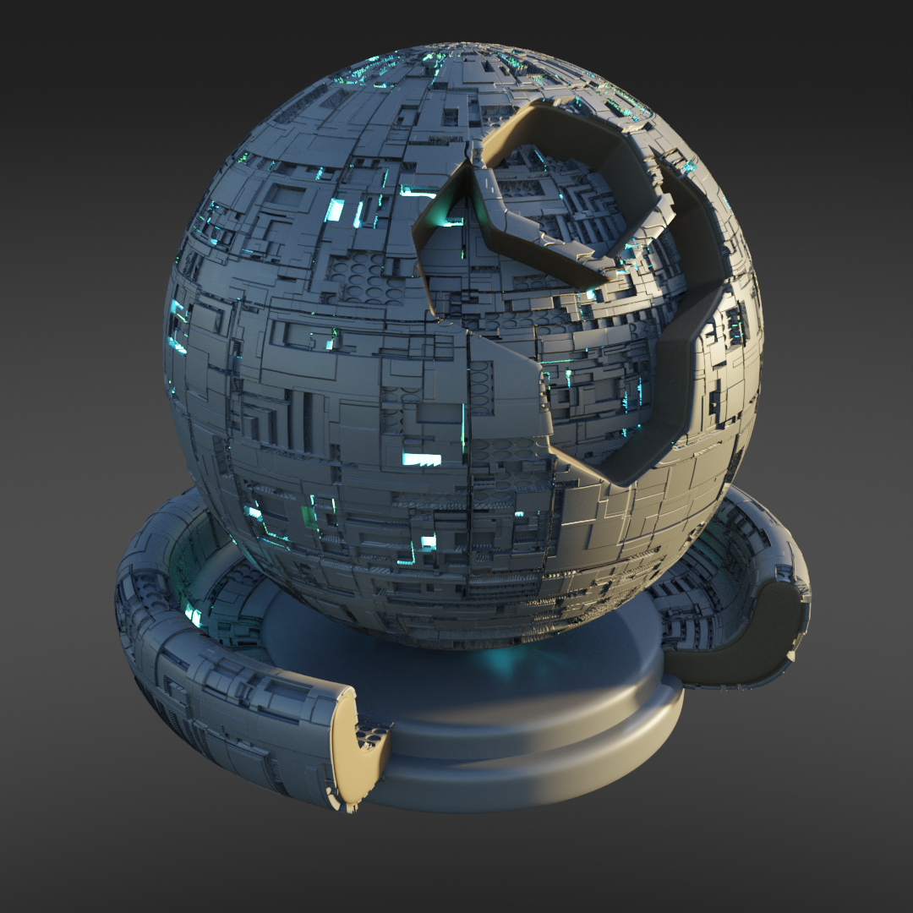

Borg
######################

* **Cycles:** Recommended with displacement
* **EEVEEE:** Not Recommended

A multilayered panel and greebled material with glowing elements.

Borg Inputs
**************************************

* **Vector**: The UV Mapping Vector Input. A UV Map is recommended.
* **Panel Color**: Color of the panels.
* **Glow Amount**: The amount of glowing details.
* **Glow Color 1**: First color variance of glow.
* **Glow Color 2**: Second color variance of glow.
* **Glow Strength**: Strenght of glow effect.
* **Piping Amount**: Amount of piping.
* **Circles Amount**: Amount of circular details.
* **Max Height**: Maximum Height for the displacement effect.

Borg Outputs
**************************************

* **Shader**: The overall material shader output.
* **Displacement**: The displacement normal map.
* **Albedo**: The diffuse color channel.
* **Metallic**: The metallic map.
* **Roughness**: The roughness map.
* **Emission**: Emission light map.
* **Height**: The height map used for control of mixing in the Emission shader.
* **Normal**: The normal map used for the bump map.
