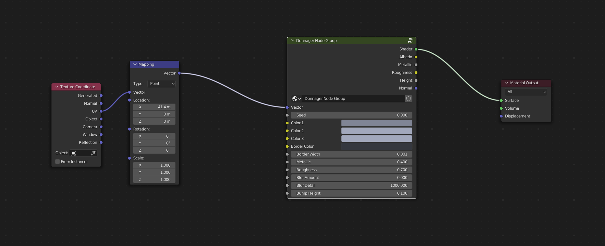

Donnager
######################

* **Cycles:** Recommended
* **EEVEE:** Compatible
  
Square overlapping panels.

Edward Israel Inputs
**************************************

* **Vector**: The UV Mapping Vector Input. A UV Map is recommended.
* **Seed**: Seed to set the random pattern.
* **Color 1**: First color variation for panels.
* **Color 2**: Second color variation for panels.
* **Color 3**: Third color variation for panels.
* **Border Color**: Border Color of seams.
* **Border Width**: Width of norder seams.
* **Metallic**: The amount of roughness in the texture.
* **Roughness**: The amount of roughness in the texture.
* **Blur Amount**: Amount of noise introduced to blue the texture.  Best for Cycles. Set to zero for EEVEE.
* **Blur Detail**: The size of the noise used for the blur effect.
* **Bump Height**: The Maximum height of the panels.

Edward Israel Outputs
**************************************

* **Shader**: The overall material shader output.
* **Albedo**: The diffuse color channel.
* **Metallic**: The metallic map.
* **Roughness**: The roughness map.
* **Height**: The height map, useful for displacement.
* **Normal**: The normal map used for the bump map.