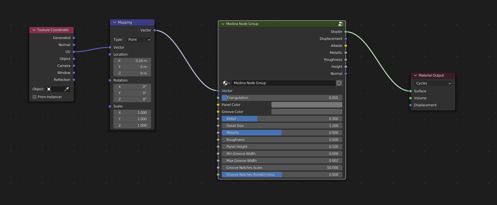

Medina
######################

* **Cycles:** Recommended
* **EEVEE:** NOT COMPATABLE

Panels with notched grooves.

Medina Inputs
**************************************

* **Vector**: The UV Mapping Vector Input. A UV Map is recommended.
* **Triangulation**: The amount of triangulation in the pattern.
* **Panel Color**: Color of the panels.
* **Groove Color**: Color of the grooves.
* **Detail**: The amount of smaller panel detailing.
* **Detail Size**: The size of the panel detailing.
* **Metallic**: The metallic map.
* **Roughness**: The roughness map.
* **Panel Height**: The height of the panels.
* **Min Groove Width**: The minimum width of the blocked goove pattern.
* **Max Groove Width**: The minimum width of the blocked goove pattern.
* **Groove Notches Scale**: Size of the noise controlling the notches.
* **Groove Notches Randomness**: Random element of the noise controlling the notches.

Medina Outputs
**************************************

* **Shader**: The overall material shader output.
* **Displacement**: The displacement normal map.
* **Albedo**: The diffuse color channel.
* **Metallic**: The metallic map.
* **Roughness**: The roughness map.
* **Height**: The height map used for control of mixing in the Emission shader.
* **Normal**: The normal map used for the bump map.