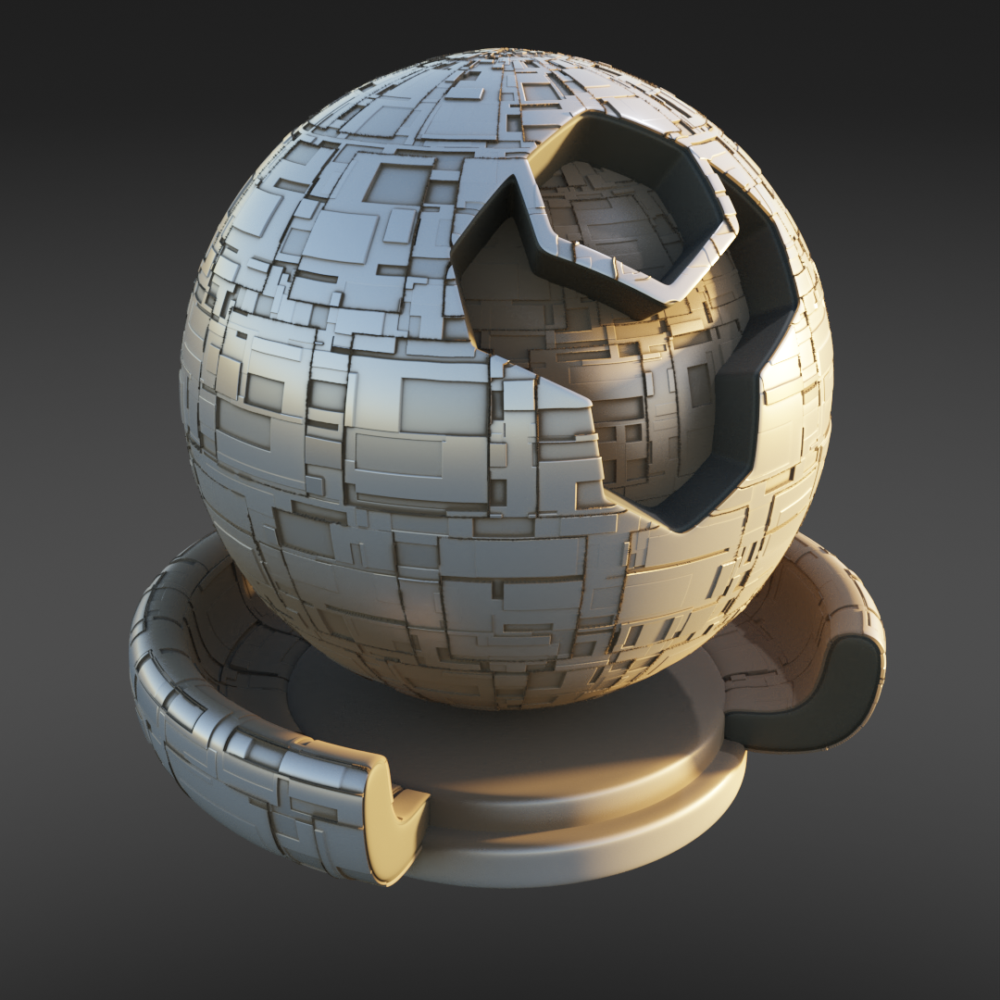
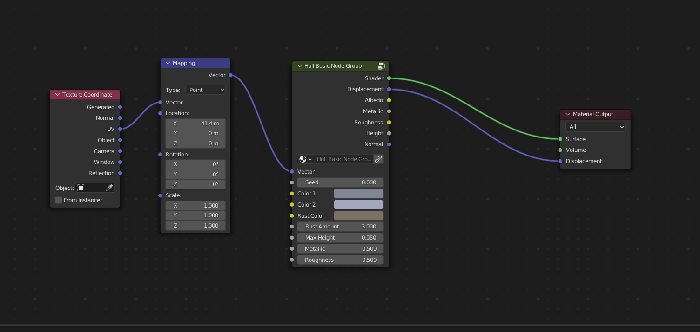

Nauvoo
######################

* **Cycles:** Recommended with Displacement
* **EEVEE:** Compatible without Displacement

Random panels with displacement and wear.

Nauvoo Inputs
**************************************

* **Vector**: The UV Mapping Vector Input. A UV Map is recommended.
* **Seed**: Seed to set the random pattern.
* **Color1**: First color variation for panels.
* **Color2**: Second color variation for panels.
* **Rust Color**: The color of the rust around the edges.
* **Rust Amount**: The amount of wear for rust introduced into the pattern.
* **Max Height**: The Maximum height of the panels.
* **Metallic**: The amount of roughness in the texture.
* **Roughness**: The amount of roughness in the texture.

Nauvoo Outputs
**************************************

* **Shader**: The overall material shader output.
* **Displacement**: The displacement normal map.
* **Albedo**: The diffuse color channel.
* **Metallic**: The metallic map.
* **Roughness**: The roughness map.
* **Height**: The height map, useful for displacement.
* **Normal**: The normal map used for the bump map.