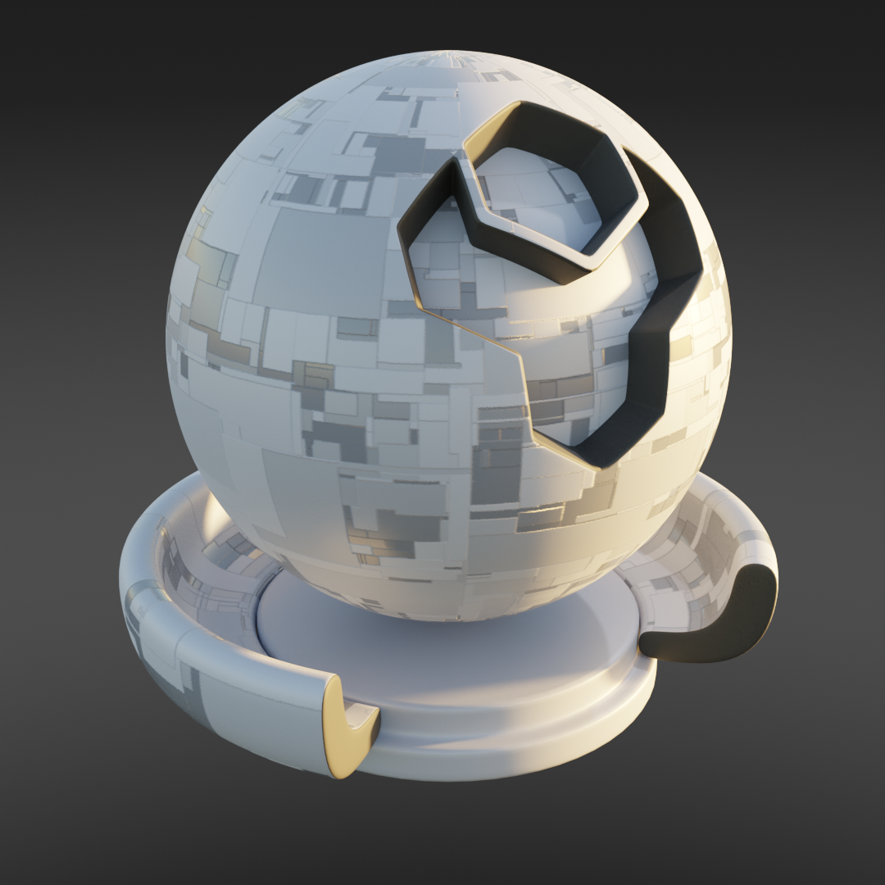
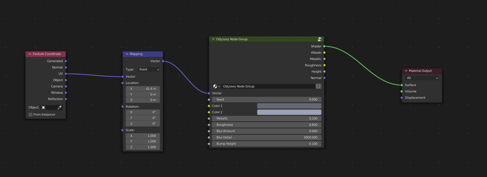

Odyssey
######################

* **Cycles:** Recommended
* **EEVEE:** Compatible with *Blur Amount* set to zero

A straightforward variation of different sized panels.

Odyssey Inputs
**********************************

* **Vector**: The UV Mapping Vector Input. A UV Map is recommended.
* **Color1**: First color variation for panels.
* **Color2**: Second color variation for panels.
* **Metallic**: Amount of metalness for the material shader.
* **Specular**: Specular Level for the material shader.
* **Blur Amount**: Amount of noise introduced to blue the texture.  Best for Cycles. Set to zero for EEVEE.
* **Blur Detail**: The size of the noise used for the blur effect.
* **Bump Height**: The maximum height for the bump map effect.

Odyssey Outputs
**********************************

* **Shader**: The overall material shader output.
* **Albedo**: The diffuse color channel.
* **Metallic**: The metallic map.
* **Roughness**: The roughness map.
* **Height**: The height map, useful for displacement.
* **Normal**: The normal map used for the bump map.