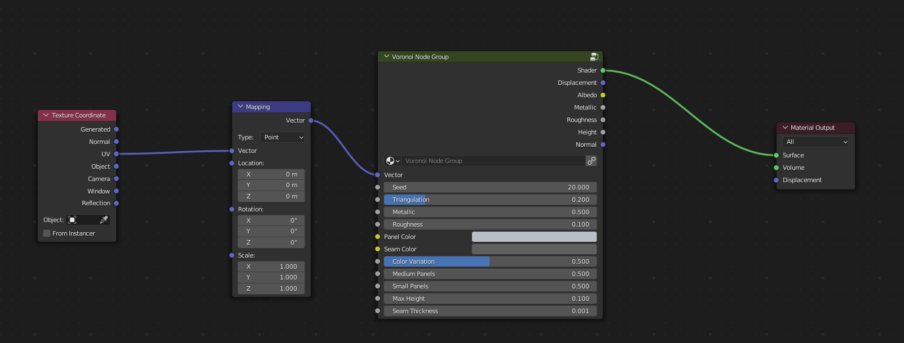

Sonny
######################

* **Cycles:** Recommended
* **EEVEE:** NOT COMPATABLE

Panels with optional seam borders and triangulation.

.. image:: ./_static/images/thumb_sonny.png
  :alt: Sonny Material
  :width: 100%

Sonny Inputs
**************************************

* **Vector**: The UV Mapping Vector Input. A UV Map is recommended.
* **Seed**: Seed to set the random pattern.
* **Triangulation**: The amount of triangulation in the pattern.
* **Metallic**: The amount of roughness in the texture.
* **Roughness**: The amount of roughness in the texture.
* **Panel Color**: Main color for panels.
* **Seam Color**: Color of the seams between the panels.
* **Color Variation**: The amount of variation in the main color.
* **Medium Panels**: The amount of medium sized panels.
* **Small Panels**: The amount of small sized panels.
* **Max Height**: The Maximum height of the panels.
* **Seam Thickness**: The thickness of the seams between the panels.

Sonny Outputs
**************************************

* **Shader**: The overall material shader output.
* **Displacement**: The displacement normal map.
* **Albedo**: The diffuse color channel.
* **Metallic**: The metallic map.
* **Roughness**: The roughness map.
* **Height**: The height map, useful for displacement.
* **Normal**: The normal map used for the bump map.
