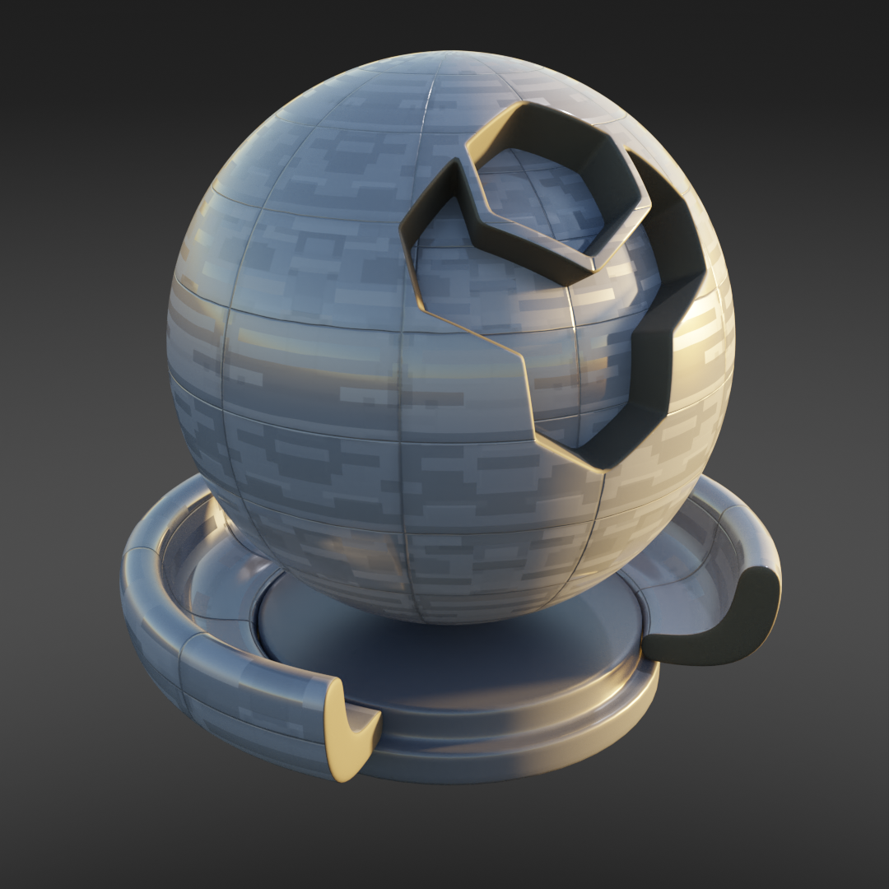
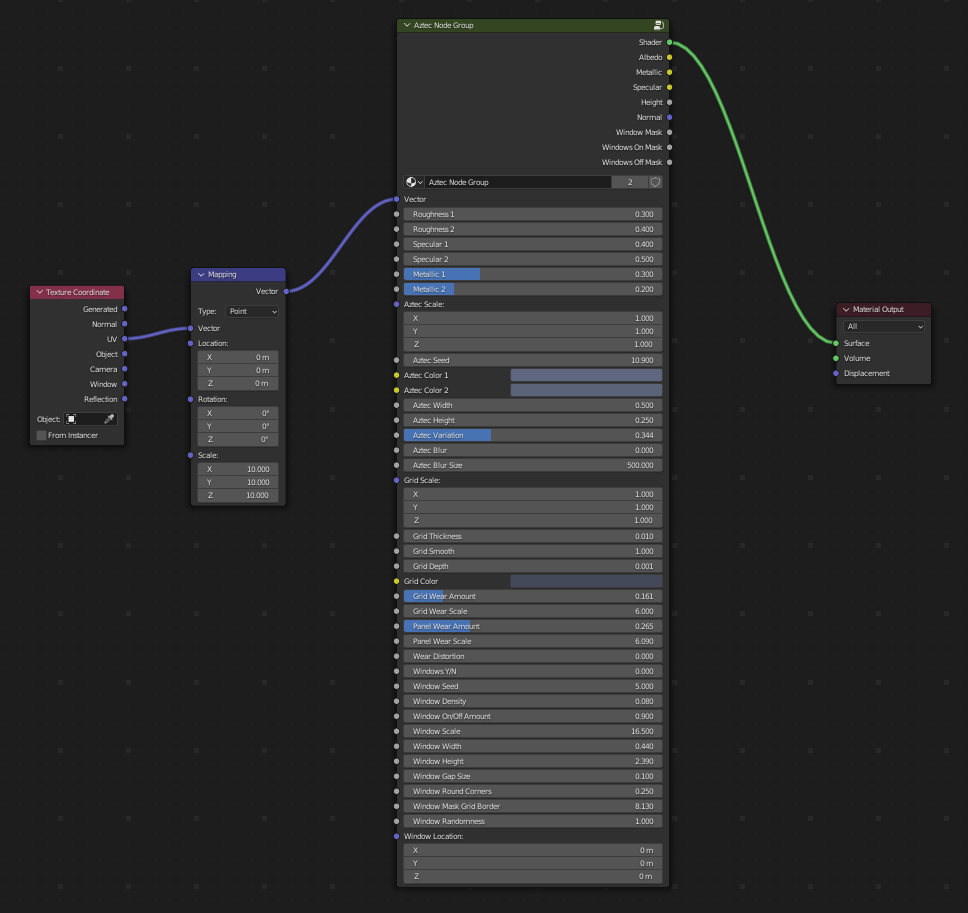

Starfleet
######################

|overview_vid|

.. |overview_vid| raw:: html

    <iframe width="560" height="315" src="https://www.youtube.com/embed/T9KxtXArDEY" title="YouTube video player" frameborder="0" allow="accelerometer; autoplay; clipboard-write; encrypted-media; gyroscope; picture-in-picture" allowfullscreen></iframe>

* **Cycles:** Recommended
* **EEVEE:** Compatible

A repeating Aztec texture with varied controls for the alternating parts of the pattern an optional grid overlay.

Starfleet Inputs
**************************************

* **Vector**: The UV Mapping Vector Input. A UV Map is recommended.
* **Aztec Scale**: X/Y/Z scale for the Aztec pattern.
* **Aztec Seed**: Numeric seed value that controls the randomness of the aztec pattern.
* **Aztec Color 1**: The first color variation for the aztec pattern.
* **Aztec Color 2**: The second color variation for the aztec pattern.
* **Aztec Width**: The relative width of the aztec pattern rectangles.
* **Aztec Height**: The relative height of the aztec pattern rectangles.
* **Aztec Blur**: The amount of noise blur to apply to the pattern (recommended in Cycles).
* **Aztec Blur Size**: The size of the noise pattern used to blur the texture.
* **Roughness 1**: Roughness level for the one half of the aztec pattern.
* **Roughness 2**: Roughness level for the remaining half of the aztec pattern.
* **Specular 1**: Specular level for the one half of the aztec pattern.
* **Specular 2**: Specular level for the remaining half of the aztec pattern.
* **Metallic 1**: Metallic level for the one half of the aztec pattern.
* **Metallic 2**: Metallic level for the remaining half of the aztec pattern.

* **Grid Scale**: The X/Y/Z size of the grid overlayed onto the Aztec pattern.
* **Grid thickness**: The thickness of the grid pattern (zero for off).
* **Grid Wear Amount**: The amount of wear applied to the grid seams.
* **Grid Wear Scale**: The size of the noise effect applied to the Grid.
* **Panel Wear Amount**: The amount of wear seen on the panels.
* **Wear Distortion**: The distortion of the noise used for the wear pattern.
* 
* **Windows Y/N**: Whether to create a window map for this part of the texture.  See Starfleet Windows.
* **Windows Seed**: Number to control the randomness of the window pattern.
* **Window Density**: Amount of windows to apply in the pattern.
* **Windows OnOff Amount**:  Controls the ratio of "On" Windows to "Off" Windows.
* **Window Width**: Relative Width of the windows.
* **Window Height**: Relative Height of the windows.
* **Window Gap Size**: The size of the gaps between the windows.
* **Window Round Corners**: The roundness of the window corners.
* **Window Mask Grid Border**: Thickness of the grid mask that will stop windows from showing.
* **Window Randomness**: How random the window pattern is.  Lower values will make the pattern more uniform.
* **Window Location**: Adjust the location of the windows relative to the rest of the pattern.

Starfleet Outputs
**************************************

* **Shader**: The overall material shader output.
* **Albedo**: The diffuse color channel.
* **Metallic**: The metallic map.
* **Roughness**: The roughness map.
* **Height**: The height map used for control of mixing in the Emission shader.
* **Normal**: The normal map used for the bump map.
* **window Mask**: Mask for the window pattern.
* **Windows On Mask**: Mask for the windows that are switched on.
* **Windows Off Mask**: Mask for the windows that are switched off.
