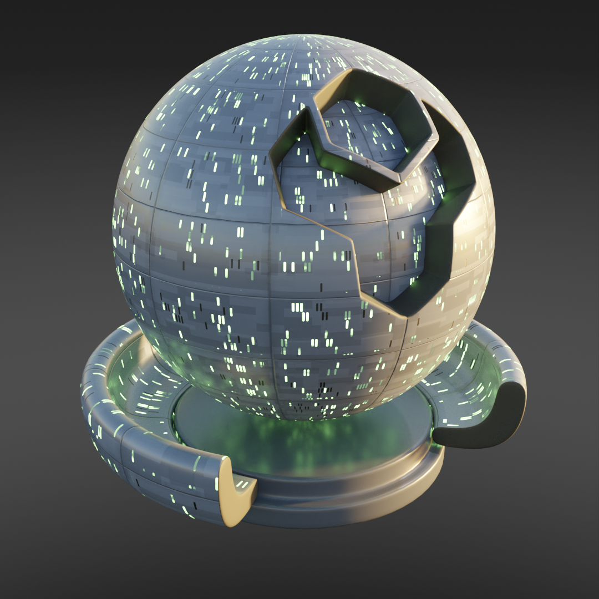
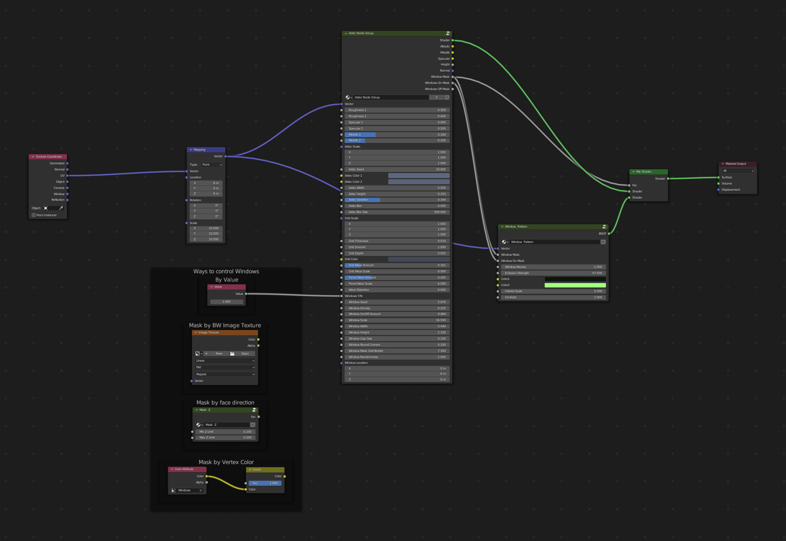

Starfleet Windows
######################

* **Cycles:** Recommended
* **EEVEE:** Compatible

As with the Starfleet Material but with an added Window material.

Aztec Node Group Inputs
**************************************

As per Starfleet Material controls.

Window Pattern Inputs
**************************************

This node group outputs a window pattern controlled by the window masks produced by the Axtec Group Node.

* **Vector**: Input UV Map.
* **Window Mask**: The pattern mask for all the windows.
* **Windows On Mask**: The pattern for just the windows that are switched on.
* **Window Recess**: How deeply the windows are recessed for the bump map (note that the bump map will only give the impression of recess).
* **Emission Strength**: Stength of the window lighting.
* **Color1**: The color of the brighter parts of the interior windows that are switched on.
* **Color2**: The color of the darker parts of the interior windows that are switched on.
* **Contrast**: Relative contrast of the interior details for the windows that are switched on.

Starfleet Windows Outputs
**************************************

* **Shader**: The overall material shader output.
* **Albedo**: The diffuse color channel.
* **Metallic**: The metallic map.
* **Roughness**: The roughness map.
* **Height**: The height map used for control of mixing in the Emission shader.
* **Normal**: The normal map used for the bump map.
* **Window Mask**: Mask for the window pattern.
* **Windows On Mask**: Mask for the windows that are switched on.
* **Windows Off Mask**: Mask for the windows that are switched off.

.. tip:: Controlling the window pattern

   .. image:: ./_static/images/starfleet_windows_texture_paint.png

   By feeding a black/white image or texture mask into the *Windows Y/N* input of the Aztec Node Group, you can control where the windows are placed.

   .. image:: ./_static/images/starfleet_windows_texture_paint2.png

   The mask was applied using Blender's Texture Paint mode.