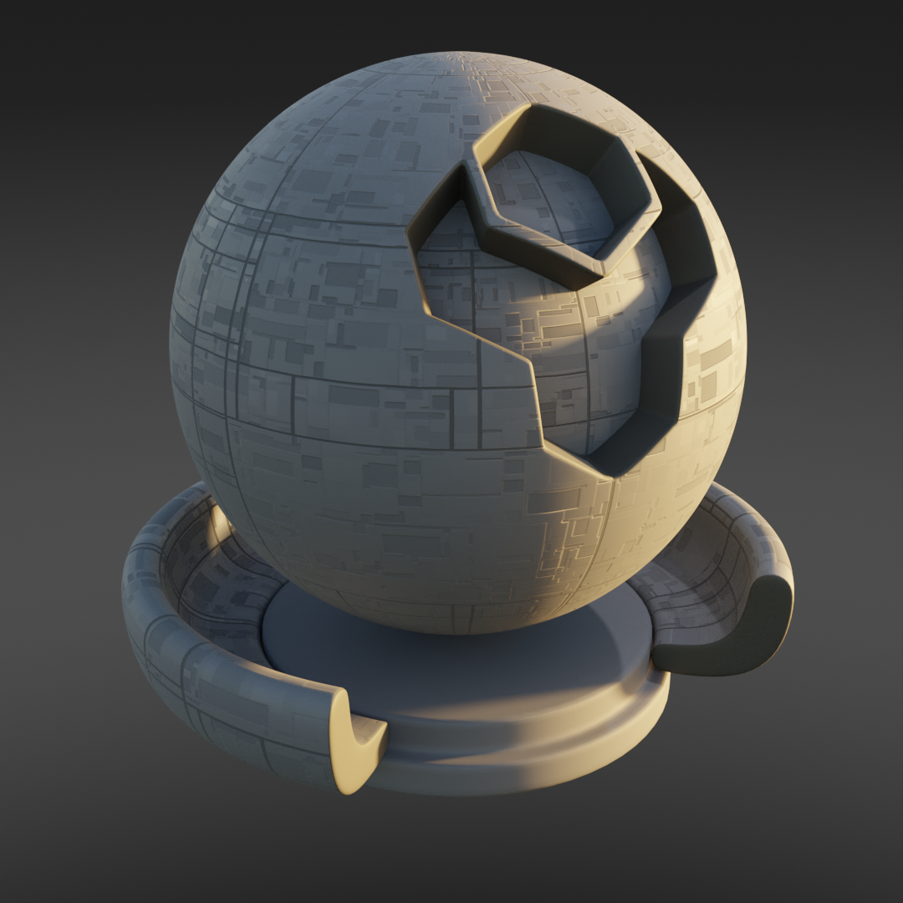
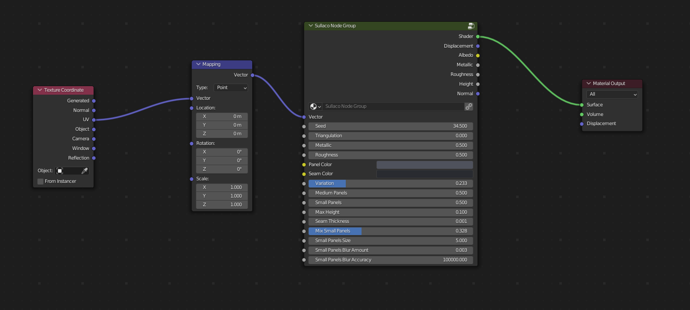

Sulaco
######################

* **Cycles:** Recommended
* **EEVEE:** Compatible

Uniform Panels with seams and optional small panel details.

Sulaco Inputs
**************************************

* **Vector**: The UV Mapping Vector Input. A UV Map is recommended.
* **Seed**: Seed to set the random pattern.
* **Triangulation**: The amount of triangulation in the pattern.
* **Metallic**: The amount of roughness in the texture.
* **Roughness**: The amount of roughness in the texture.
* **Panel Color**: Main color for panels.
* **Seam Color**: Color of the seams between the panels.
* **Color Variation**: The amount of variation in the main color.
* **Medium Panels**: The amount of medium sized panels.
* **Small Panels**: The amount of small sized panels.
* **Max Height**: The Maximum height of the panels.
* **Seam Thickness**: The thickness of the seams between the panels.
* **Mix Small Panels**: Amount of smaller panel detailing to mix into the main panels.
* **Small Panels size**: Size of small panels detailing.
* **Small Panels Blur Amount**: Amount of noise blur on small panel detailing.
* **Small Panel Blur Accuracy**: Level of noise bluring to apply.

Sulaco Outputs
**************************************

* **Shader**: The overall material shader output.
* **Displacement**: The displacement normal map.
* **Albedo**: The diffuse color channel.
* **Metallic**: The metallic map.
* **Roughness**: The roughness map.
* **Height**: The height map, useful for displacement.
* **Normal**: The normal map used for the bump map.